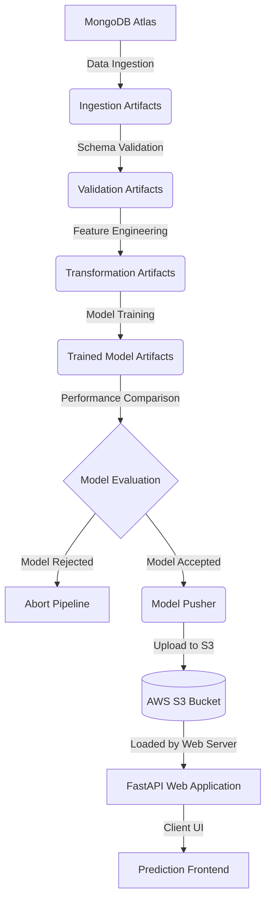
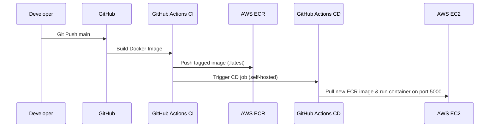

# Vehicle Insurance MLOps Project

A comprehensive, industry-grade end-to-end MLOps pipeline designed to predict whether a customer will be interested in purchasing vehicle insurance. The system leverages an automated machine learning workflow—covering data ingestion, validation, transformation, model training, evaluation, and deployment—integrated with AWS services and GitHub Actions for continuous delivery.

---

## 🏗️ Architecture & Pipeline Workflows

The project is structured around standard modular engineering practices:



### 1. Pipeline Stages (`src/components/`)
* **Data Ingestion:** Automatically fetches historical vehicle insurance data from MongoDB Atlas, performs train-test splitting (80/20 ratio by default), and outputs structured CSV artifacts.
* **Data Validation:** Validates the ingested dataset's schema against [config/schema.yaml](file:///f:/Vehicle%20insurance%20mlops/Vehicle_insurance_MLOps/config/schema.yaml) to ensure datatypes, columns, and value ranges meet training specifications.
* **Data Transformation:** Engineers raw columns into model-ready numeric arrays. Applies custom scaling and preprocessors (e.g. standard scaling, handling categories) and exports the pipeline state as `preprocessing.pkl`.
* **Model Trainer:** Automatically trains machine learning classifiers (e.g. Random Forest), logs performance metrics, and validates model accuracy against predefined thresholds before serializing as `model.pkl`.
* **Model Evaluation:** Compares newly trained model performance against the production-grade model currently residing in the AWS S3 Registry.
* **Model Pusher:** If the new model outperforms the current registry model by a configured threshold (e.g., `0.02`), it automatically packages and pushes it to your AWS S3 bucket.

### 2. Live Web Application (`app.py` & `src/pipline/`)
* **FastAPI Server:** Serves as the web hosting backend. Contains `/` (Prediction Route) and `/train` (Trigger full pipeline).
* **Prediction Pipeline:** On user submission, forms input data into a pandas DataFrame, pulls the active model dynamically from AWS S3, runs predictions, and serves the results on a beautiful, glassmorphic UI.

---

## 🛠️ Tech Stack & Key Technologies

* **Language:** Python 3.10+
* **Framework:** FastAPI, Jinja2, Uvicorn
* **Libraries:** Scikit-Learn, Pandas, NumPy, Boto3, PyMongo, YAML
* **Database:** MongoDB Atlas (Cloud NoSQL)
* **Cloud Infrastructure (AWS):** S3 (Model Registry), ECR (Elastic Container Registry), EC2 (Hosting Compute Node)
* **CI/CD & DevOps:** Docker, GitHub Actions (Self-Hosted Runner)

---

## 💻 Local Setup & Installation

Follow these steps to run the pipeline or start the web server locally:

### 1. Environment Configuration
Create and activate a virtual environment (using Conda or Virtualenv):
```bash
conda create -n vehicle python=3.10 -y
conda activate vehicle
```

Install local package dependencies:
```bash
pip install -r requirements.txt
```

Verify that the local package installer (`setup.py` / `pyproject.toml`) successfully registered package modules:
```bash
pip list
```

### 2. Set Up Environment Variables
Create the required database and cloud access credentials in your local terminal:

#### For Bash/Zsh Terminals:
```bash
export MONGODB_URL="mongodb+srv://<username>:<password>@cluster.mongodb.net/"
export AWS_ACCESS_KEY_ID="your_aws_access_key"
export AWS_SECRET_ACCESS_KEY="your_aws_secret_access_key"
export AWS_DEFAULT_REGION="us-east-1"
```

#### For PowerShell Terminals:
```powershell
$env:MONGODB_URL="mongodb+srv://<username>:<password>@cluster.mongodb.net/"
$env:AWS_ACCESS_KEY_ID="your_aws_access_key"
$env:AWS_SECRET_ACCESS_KEY="your_aws_secret_access_key"
$env:AWS_DEFAULT_REGION="us-east-1"
```

### 3. Run the Server
Launch the FastAPI development environment:
```bash
python app.py
```
Visit **`http://127.0.0.1:5000`** in your browser to interact with the application.

---

## 🚀 Cloud Setup & CI/CD Deployment Guide

The production system is deployed on an **AWS EC2** instance running inside a **Docker Container** driven by **GitHub Actions** and a self-hosted runner.



### 1. MongoDB Setup
* Create a free cluster on MongoDB Atlas (`M0` service).
* Go to **Network Access** and add IP `0.0.0.0/0` to allow EC2 to fetch data.
* Retrieve your python connection driver string and set it in your repository secrets/environment.

### 2. AWS S3 & ECR Setup
* Create an IAM User (`firstproj`) with `AdministratorAccess` and generate Access Keys.
* Create a general-purpose AWS S3 bucket named `my-model-mlopsproj-ssp` in `us-east-1` region (with public access unblocked for model fetching).
* Create an ECR repository named `vehicleproj` in `us-east-1` to store pipeline Docker images.

### 3. EC2 VM Hosting & Runner Configuration
1. Launch an Ubuntu 24.04 instance (`T2.Medium` recommended, minimum 30GB storage).
2. Configure **Security Group** Inbound rules to allow traffic on port **`5000`** (Custom TCP, `0.0.0.0/0`).
3. Connect to your EC2 instance and install Docker:
   ```bash
   curl -fsSL https://get.docker.com -o get-docker.sh
   sudo sh get-docker.sh
   sudo usermod -aG docker ubuntu
   newgrp docker
   ```
4. In your GitHub Repository, navigate to **Settings > Actions > Runners > New self-hosted runner (Linux)**. Copy and paste the provided commands into your EC2 terminal to connect the runner.
5. To run the runner in the background permanently, install it as a system service:
   ```bash
   sudo ./svc.sh install
   sudo ./svc.sh start
   ```

### 4. GitHub Actions Secrets Configuration
Navigate to **GitHub Repository Settings > Secrets and variables > Actions** and add the following repository secrets:
* `AWS_ACCESS_KEY_ID` (Your AWS access key)
* `AWS_SECRET_ACCESS_KEY` (Your AWS secret key)
* `AWS_DEFAULT_REGION` (`us-east-1`)
* `ECR_REPO` (`vehicleproj`)
* `MONGODB_URL` (Your MongoDB Atlas connection URI)

---

## 📈 Continuous Development & Model Upgrades
Once the setup is complete, making modifications or pushing updates to the `main` branch will automatically build, test, and push the latest version of the code to ECR and redeploy it to your EC2 node on `http://<your-ec2-ip>:5000` without any manual commands or downtime. 

To retrain your model with fresh MongoDB data, simply navigate to the **`/train`** endpoint on your production IP address to trigger the complete automated training pipeline.
